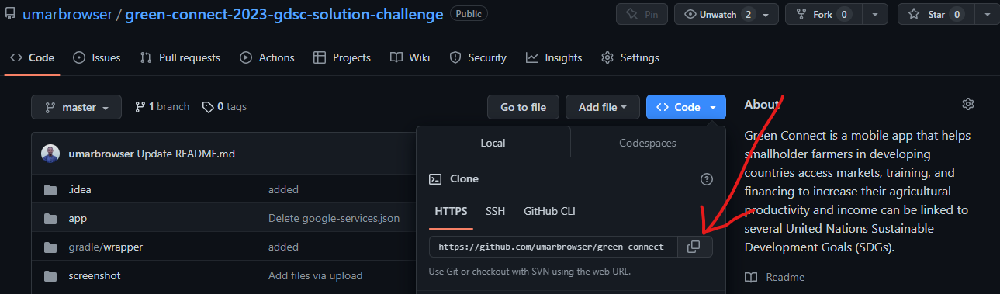
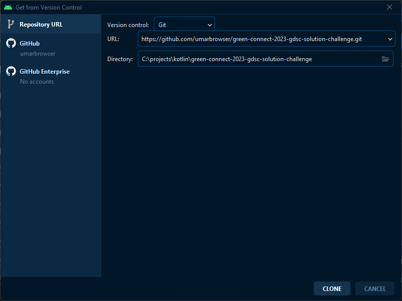
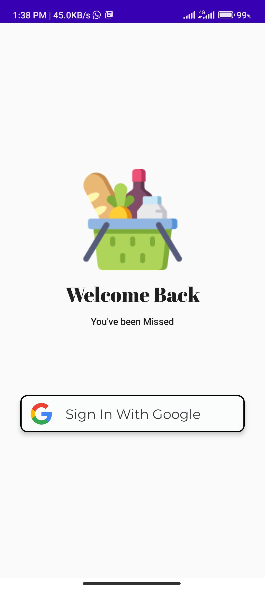
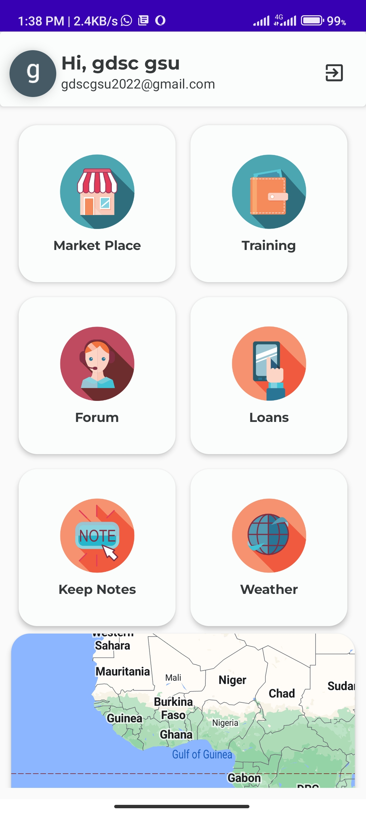
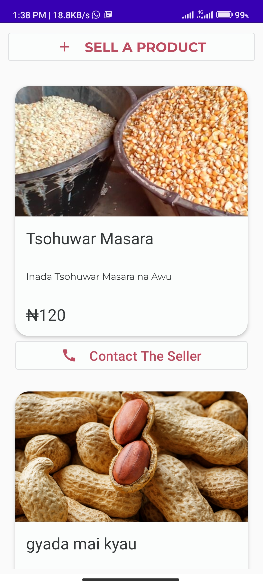
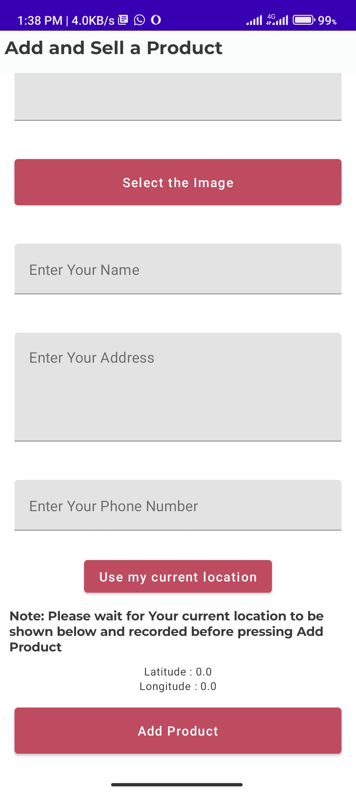
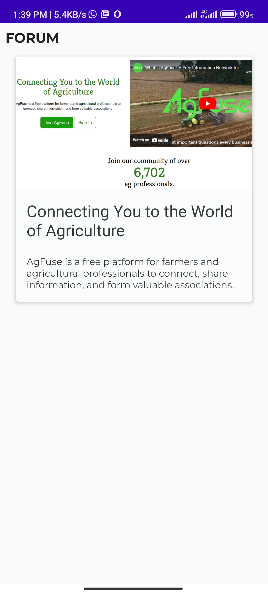
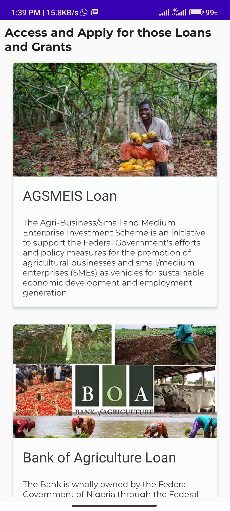
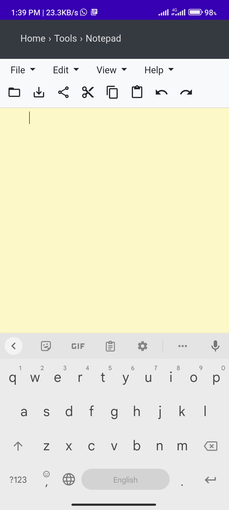
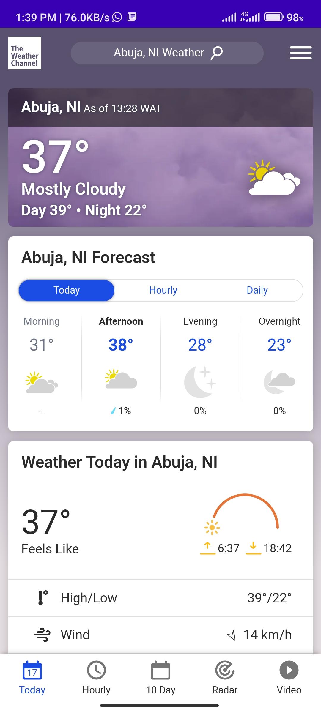

<h1 align="center"> Green Connect 2023 Google Developer Student Club (Gombe State University, Nigeria), Solution Challenge</h1>


## Introduction 🙋‍♂️
> Green Connect is a mobile app that helps smallholder farmers in developing countries access markets, training, and financing to increase their agricultural productivity and income can be linked to several United Nations Sustainable Development Goals (SDGs).

* **Goal 1: No Poverty** - Green Connect addresses poverty reduction by providing smallholder farmers with access to markets, training, and financing to increase their agricultural productivity and income thereby alleviating poverty.

* **Goal 2: Zero Hunger** - Green Connect also supports the Zero Hunger initiative by increasing smallholder farmers' access to markets, training, and financing, which can help them produce more food to feed themselves and their communities.

* **Goal 5: Gender Equality** - Women make up a significant portion of smallholder farmers in developing countries, and this project can help increase their productivity and income, thus improving their economic status and promoting gender equality.

* **Goal 8: Decent Work and Economic Growth** - Green Connect can create employment opportunities for farmers and other stakeholders in the agriculture value chain.

> The specific targets that we are aiming to achieve through our solution are:

* **Target 1.1:** By 2030, eradicate extreme poverty for all people everywhere, currently measured as people living on less than $1.25 a day.

* **Target 2.3:** By 2030, double the agricultural productivity and incomes of small-scale food producers, in particular women, indigenous peoples, family farmers, pastoralists, and fishers, including through secure and equal access to land, other productive resources, and inputs, knowledge, financial services, markets, and opportunities for value addition and non-farm employment.

* **Target 8.3:** Promote development-oriented policies that support productive activities, decent job creation, entrepreneurship, creativity, and innovation, and encourage the formalization and growth of micro-, small- and medium-sized enterprises, including through access to financial services.

* **Target 9.3:** Increase the access of small-scale industrial and other enterprises, in particular in developing countries, to financial services, including affordable credit, and their integration into value chains and markets.

* **Target 10.2:** By 2030, empower and promote the social, economic and political inclusion of all, irrespective of age, sex, disability, race, ethnicity, origin, religion or economic or other status.

* **Target 12.3:** By 2030, halve per capita global food waste at the retail and consumer levels and reduce food losses along production and supply chains, including post-harvest losses.

> We chose these specific SDGs and targets because our solution directly addresses the challenges faced by smallholder farmers in developing countries, who often live in poverty, lack access to food, and have limited economic opportunities. By providing these farmers with a platform to access markets, training, and financing, we can help them increase their agricultural productivity and income, improving their livelihoods and contributing to the achievement of the SDGs. Additionally, our solution aligns with the UN's call to promote inclusive and sustainable economic growth, as we are focused on empowering small-scale food producers and supporting entrepreneurship in developing countries.


[]() []() [](https://opensource.org/licenses/Apache-2.0)

## The app Includes the Following:
* **User Login System** that allows farmers to with their Google Account and securely access the app.

* **Marketplace** feature that connects farmers with buyers such as processors and traders, to sell their products.

* **Forum** feature that allows farmers to connect with other farmers and experts in the field for support and advice.

* **Training** module that provides educational resources and videos on best practices for farming, including information on crop management, soil health, and market trends.

* **Loan** module that allows farmers to apply for and receive loans for investments in their farms.

* **Note Keeping** feature that provides farmers with insights on their farming operations, such as crop yields and costs, to help them make more informed decisions.

* **Weather** feature that provide farmers with up-to-date information on the amount and intensity of rainfall in their area, helping them to make informed decisions about when to plant, irrigate, or harvest their crops.

## Download and Install APK File
> [](https://github.com/umarbrowser/green-connect-2023-gdsc-solution-challenge/raw/master/build/green-connect.apk)
* Download the above File to your Android Device
* Initiate the installation either through the download notification or a file browser.
* You’ll receive a warning at the bottom of the phone letting you know that you need to give that app permission to install the file.
* Tap the Settings button to proceed.
* On the next page, find the app from the previous step and toggle it on.
* A prompt should pop up, giving you the option to install the app. Go ahead and follow the instructions to install.
* **Note** — Sometimes, you may need to initiate installation again. For example, if you tap the notification and use your browser to do it, you sometimes need to tap the notification again to get the install prompt after giving the app permission.

## How to build from Source

1. Copy this ```https://github.com/umarbrowser/green-connect-2023-gdsc-solution-challenge.git``` for follow the picture below.



2. Install Lattest version of Android Studio from [https://developer.android.com/studio](https://developer.android.com/studio)

3. Open Android Studio and select **GET FROM VCS**.

4. Choose "Git" from the drop-down menu and paste this ```https://github.com/umarbrowser/green-connect-2023-gdsc-solution-challenge.git``` into the "URL" field.

5. Choose the directory where you want to save the project and click "Clone".



6. Once the cloning process is complete, Android Studio will open the project.

7. Add API key to local.properties.
```
# local.properties
GOOGLE_MAPS_API_KEY=<Your Map API Key>
```

8. Sync your Gradle files to download the necessary dependencies.

9. You should now be able to run the Green Connect by clicking on the "Run" button in Android Studio. If you encounter any issues, make sure that you have the latest version of Android Studio and that your Android SDK is up-to-date. 

## Application Screenshots

| Login with Google  | Home Page | Market Place |
| ------------- | ------------- | ------------- |
|   |   |   |

| Sell a Product  | Training | Forum |
| ------------- | ------------- | ------------- |
|   |   |   |

| Loans  | Keep Notes | Weather |
| ------------- | ------------- | ------------- |
|   |   |   |

## Shoutout
* Homepage Graphics [Freepik](https://www.freepik.com/)
* Logo and Color Idea [Figma](https://www.figma.com/community/file/934110535550780598)
